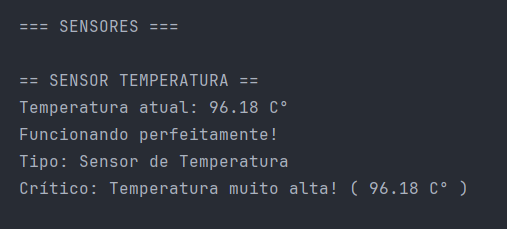
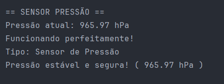
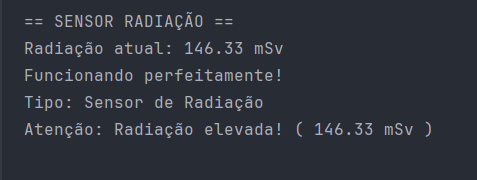
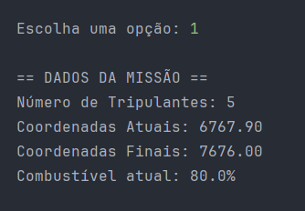
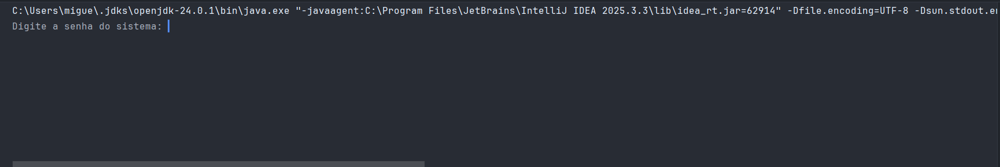
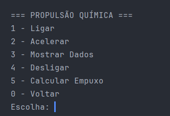
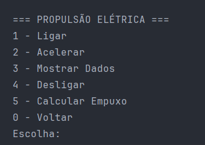
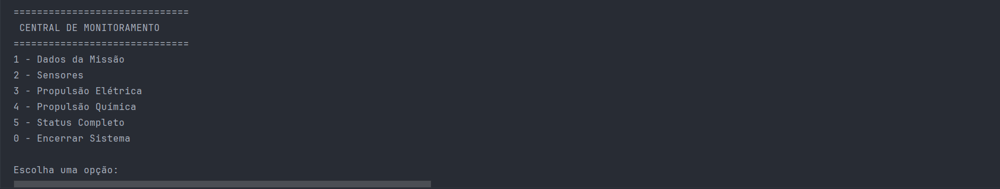

# Plataforma de Monitoramento Espacial

## Visão Geral

A Plataforma de Monitoramento Espacial é um sistema desenvolvido para monitorar componentes e sistemas de uma estação espacial. Utiliza conceitos avançados de Programação Orientada a Objetos (POO) para garantir detecção automática de anomalias e gerenciamento eficiente de recursos críticos.

## Escopo do Projeto

Este projeto implementa uma solução completa de monitoramento que engloba:

- Detecção automática de falhas em componentes espaciais
- Leitura contínua de sensores especializados
- Controle centralizado de sistemas de propulsão
- Gerenciamento protegido de dados de missão
- Sistema de alertas em múltiplos níveis de severidade

## Arquitetura e Conceitos de POO Aplicados

### 1. Classe Abstrata - ComponenteEspacial

A classe abstrata `ComponenteEspacial` serve como molde para todos os componentes da estação espacial.

**Características:**
- Atributos comuns: identificador, nome, status operacional e temperatura
- Métodos concretos: ligar e desligar componentes
- Método abstrato: obriga subclasses a implementarem comportamentos específicos
- Herança utilizada por componentes especializados

**Responsabilidades:**
- Definir interface padrão para todos os componentes
- Implementar funcionalidades compartilhadas
- Forçar implementação de métodos críticos em subclasses

### 2. Interface - Sensor

A interface `Sensor` estabelece o contrato que todos os sensores especializados devem seguir.

**Métodos Obrigatórios:**
- `lerValor()`: obtém medição atual do sensor
- `verificarFuncionamento()`: valida operação correta
- `obterTipo()`: identifica categoria do sensor

#### SensorTemperatura



- Monitora variações térmicas em tempo real
- Faixa operacional: 0°C a 100°C
- Validação de limites críticos

#### SensorPressao



- Controla pressão interna da estrutura
- Faixa operacional: 900 a 1200 kPa
- Detecção de despressurização

#### SensorRadiacao



- Mede níveis de radiação ambiental
- Faixa operacional: 0 a 500 Sv/h
- Alerta para exposição perigosa

### 3. Encapsulamento - DadosMissao



A classe `DadosMissao` implementa proteção rigorosa de dados críticos da missão.

**Atributos Privados:**
- Coordenadas da trajetória
- Nível de combustível
- Número de tripulantes
- Código de acesso restrito

**Mecanismos de Proteção:**
- Validação em todos os setters
- Recusa de valores negativos ou inválidos
- Autenticação por senha para dados sensíveis
- Bloqueio de modificações não autorizadas



**Getters e Setters:**
- `obterCombustivel()` / `definirCombustivel()`
- `obterCoordenadas()` / `definirCoordenadas()` - requer autenticação
- `obterTripulantes()` / `definirTripulantes()`

**Validações Implementadas:**
- Combustível entre 0% e 100%
- Tripulantes não-negativo
- Coordenadas em intervalo válido
- Alerta automático quando combustível cai abaixo de 20%

### 4. Herança - SistemaPropulsao

A classe abstrata `SistemaPropulsao` define o comportamento genérico de qualquer sistema propulsor.

**Estrutura Base:**
- Atributos comuns: potência, status, eficiência
- Métodos concretos: ligar e desligar
- Método abstrato: sobrescrita do método acelerar()

#### PropulsaoQuimica



- Combustível: propelente químico
- Empuxo calculado por reação química
- Consumo proporcional à potência

#### PropulsaoEletrica



- Combustível: carga elétrica
- Empuxo calculado por campo eletromagnético
- Consumo reduzido e eficiente

**Validações:**
- Potência limitada entre 0% e 100%
- Rejeição de valores fora da faixa
- Segurança operacional garantida

## Sistema de Monitoramento



O sistema oferece uma central de monitoramento integrada com menu interativo.

### Menu Principal

Operações disponíveis:

1. Verificar status de sensores - Leitura de todos os sensores ativos
2. Controlar sistema de propulsão - Ativação e ajuste de propulsores
3. Gerenciar dados da missão - Acesso protegido aos dados críticos
4. Simular alertas de sistema - Teste de sistema de alertas
5. Exibir status completo - Visão geral de todos os sistemas
0. Sair - Encerrar aplicação

**Características:**
- Interface baseada em texto
- Validação robusta de entrada do usuário
- Loop principal contínuo
- Retorno automático às opções do menu

## Funcionalidades Implementadas

### Sistema de Sensores

- Leitura de valores com simulação configurável
- Verificação automática de funcionamento
- Definição dinâmica de limites de alerta
- Detecção quando valor ultrapassa limite estabelecido
- Armazenamento de histórico de leituras

### Sistema de Propulsão

- Ativação e desativação de motores individuais
- Controle de aceleração com porcentagem (0-100%)
- Cálculo automático de empuxo gerado
- Validação rigorosa de entrada de dados
- Comportamento diferenciado por tipo de propulsor

### Dados da Missão

- Coordenadas protegidas por autenticação
- Validação de nível de combustível
- Alerta automático em combustível crítico
- Rastreamento de trajetória
- Registro de número de tripulantes

### Sistema de Alertas

- Verificação contínua de sensores
- Três níveis de severidade:
  - ATENÇÃO: valor próximo ao limite
  - ALERTA: valor no limite
  - CRÍTICO: valor acima do limite
- Mensagens claras e descritivas
- Notificação automática ao usuário

## Como Executar

### Pré-requisitos

- Java Development Kit (JDK) versão 8 ou superior
- Compilador javac
- Terminal ou prompt de comando

1. **Clone este repositório:**
    ```bash
    https://github.com/mig-2505/GS-Poo-Plataforma-de-Monitoramento-Espacial
    ```

2. **Abra o projeto no IntelliJ IDEA.**

3. **Compile e execute o arquivo principal:**
    - Basta executar o arquivo `SistemaMonitoramento.java`.

## Integrantes 
1- Miguel Vanucci Delgado RM: 563491
2- João Vitor RM: 566541
